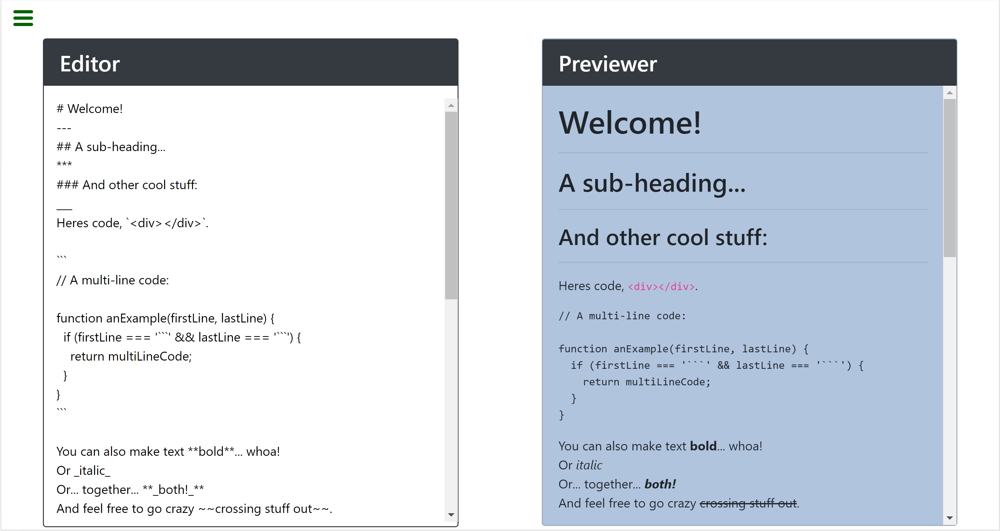

# Markdown Previewer

Convert plain text format to HTML.

## Tech

Stack:

- React.js
- Bootstrap

### Installations

1. Install dependencies with `npm install`
2. Run app on localhost:3000 with `npm start`
